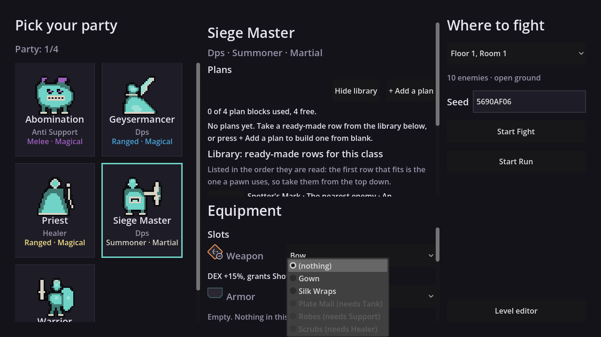
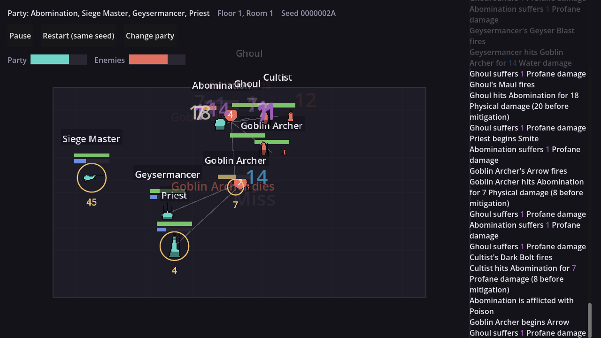

# How to build this game again

Order of operations, the code shapes that mattered, and the traps. The full
implementation is in the repo and you are rewriting it anyway. What is worth
carrying over is the sequence and the things that cost us weeks.

Snippets are GDScript because that is what we used. They are illustrative, not
copy-paste — each one is the *shape* that was hard to arrive at.

## The one rule everything else follows from

**The simulation knows nothing about the screen.** It takes a state, steps it a
tick at a time, and emits events. Everything the player sees is built from those
events and nothing else.

Get this wrong and you spend a month untangling it. Get it right and the view
can never show a number it cannot explain, a fight replays from a seed, and you
can measure the game without rendering it.

```
Content  ->  actions, classes, enemies, rooms
Core     ->  the vocabulary all layers share
Plans    ->  what a unit intends this tick
Combat   ->  applies intents, resolves, emits events
UI       ->  draws the events
```

Nothing points left to right except through that vocabulary.

---

# Part 1: one room

## Step 1 — the vocabulary

One file of enums and constants: damage types, statuses, event kinds, teams,
tick rate. Everything imports it. Write it first and expect to read it
constantly.

```gdscript
class_name CG

const TICKS_PER_SECOND := 15

enum DamageType { PHYSICAL, WATER, PROFANE }
enum Team { PLAYER, ENEMY }
enum EventKind { ACTION_BEGAN, DAMAGED, STATUS_APPLIED, DIED, ... }
```

**Ticks, never seconds.** The simulation counts ticks; seconds exist only in
text the player reads. Every duration bug we had came from mixing them.

```gdscript
# In the sim, always:
unit.cooldown_remaining = action.cooldown_ticks

# Only at the very edge, for a human:
"%.1fs" % (ticks / float(CG.TICKS_PER_SECOND))
```

## Step 2 — state and events

Two shapes: **the unit** and **the state**.

```gdscript
class_name CombatUnit
var id: int
var team: CG.Team
var position: Vector2
var hp: int
var resource: int
var statuses: Dictionary       # status -> remaining ticks
var busy_until_tick: int       # wind-up, recovery, channel
var intent                     # what it decided this tick

class_name CombatState
var units: Array[CombatUnit]
var terrain: Array
var tick: int
var rng: RandomNumberGenerator  # in the state, not a global
var outcome: Outcome
var events: Array[CombatEvent]
```

Then the event. Make it carry **everything a view could want to say**, not the
minimum today's view needs.

```gdscript
class_name CombatEvent
var kind: CG.EventKind
var tick: int
var source_id: int
var target_id: int
var action_id: StringName
var amount: int                     # the raw roll
var amount_after_mitigation: int    # what actually landed
var mitigation_cause: CG.MitigationCause
var status: StringName
var source_plan: int                # which row chose this, or -1
```

We shipped the raw roll and the applied figure and **threw away the number
between them**. Every reader then subtracted the wrong two and called the
difference mitigation — 13.4% of hits were mislabelled, and a playtester's
loudest complaint turned out to be a target with 1 hp left, not armour.

**Put the rng in the state and seed it.** One seed, one fight, byte-identical
every time. Check it early and keep checking it; every measurement you take
later rests on it.

```gdscript
# The check that protects everything downstream.
var a := run_fight(seed, party, room)
var b := run_fight(seed, party, room)
assert(a.digest() == b.digest())
```

## Step 3 — the tick loop

```gdscript
func step() -> void:
    for u in state.units:
        if u.alive and not is_busy(u):
            u.intent = decide(u)      # plans, or the fallback
    resolve_intents()                 # movement, actions, damage
    tick_statuses()                   # dots, cooldowns, regen, hazards
    check_outcome()
    state.tick += 1
```

Keep the phases separate and named. When something is wrong you will want to
know which phase it was wrong in.

**A busy unit does not decide.** Wind-up, recovery and channels all mean "not
free". Get this wrong and units re-decide every tick and finish nothing.

## Step 4 — one action, end to end

Not five. One. A melee attack: wind-up, fire, damage event, recovery.

```gdscript
# Content is data, not code. This is the whole definition.
{
    id = &"warrior_strike",
    windup_ticks = 3,
    recovery_ticks = 4,
    range = 45.0,
    power = 8,
    damage_type = CG.DamageType.PHYSICAL,
    cost = 0,
}
```

Get one action correct through every phase before adding a second. Everything
after this is content.

## Step 5 — the plan layer

This is the game. A plan is an ordered list of rows; a row is blocks.

```
ACTION      what to do
TARGETING   who to do it to
MOVEMENT    where to stand
CONDITION   when
```

A unit runs **the first row whose condition holds**, top down.

```gdscript
func decide(unit) -> Intent:
    for i in unit.plans.size():
        var row = unit.plans[i]
        if row.condition_holds(unit, state) and row.affordable(unit):
            return row.to_intent(unit, state, i)   # i is source_plan
    return fallback(unit, state)                   # source_plan = -1
```



Four things we learned expensively:

- **The fallback must be visible** — an immutable row the player can read but
  not edit. A pawn doing something the player cannot find in the plans breaks
  the loop twice: once when it happens, again when there is nowhere to change
  it.
- **Every block costs one, a condition costs zero, and the budget is an
  attribute.** Do the arithmetic by construction so no second copy can drift:

  ```gdscript
  func blocks_used() -> int:
      var n := 0
      for row in plans:
          n += row.block_count()   # never a stored counter
      return n
  ```

- **Start the editor empty and offer the presets as a library.** We shipped
  preset rows first; every class then sat exactly at its budget, so the Add
  button was always refused and the editor's central affordance was dead on
  arrival. Starting empty took losses from 1.7% to 9.2% **with no number
  changed**.
- **Order is priority, so the library must read top-down.** A library sorted
  "simplest first" teaches an order that loses, because the row a player copies
  to the top is the row that fires.

## Step 6 — content, then check it can actually happen

Now write five classes and a dozen enemies.

**Then build the probe that reports any action which never fires in a real
fight.** Build it before you think you need it. We found seven mechanics that
existed and never fired — a block, an execute, a cleanse, a claw, a chain toss,
a taunt aura, and a movement block a player could not add. **Every one was found
by a probe. None was found by looking.**

What it catches:

- the fallback cannot reach ally-targeted, zero-power or sustained actions
- a row gated below the fallback's own threshold can never fire first
- an action listed after one that is always affordable never gets a turn

That last one is worth stating as a rule: **"first affordable in list order" is
a hidden rule.** It is why one of our actions only worked when placed first in
its class definition, and it was mistaken for a balance problem twice before
anyone found the cause.

## Step 7 — the screen, events only

Arena, units, bars, and **a combat log that names the row which chose each
action**.

![A fight in progress. Note `[plan 5]` in the log, and the damage line carrying all three numbers](Screenshots/finch_channel_in_a_fight_1920x1080.png)

```
Warrior begins Taunt [plan 3]
Priest begins Bolt [no plan]
Goblin Archer hits Abomination for 7 Physical damage (8 raw, 1 stopped by its toughness)
```

That tag is the most valuable thing on the screen. Four blind playtesters
independently used it to find a row worth changing.

**Two words, not one.** `[no plan]` when the editor is empty, `[default]` when
rows exist and all missed. We shipped one word for both and hid the difference
between "you wrote nothing" and "what you wrote did not apply".

**Then make units clickable**, and let the click answer everything: resource,
wind-up, target, who is aiming at it, statuses with time left. Two testers
called ours the best thing in the game — and **six never found it**, because the
click target was a 30px body under a name plate wider than the unit.

## Step 8 — measure before you tune

Build these before touching a balance number:

- a **sample runner** — every party against every room over many seeds, printing
  wins, health and fight length
- a **cost table** — what each room costs each party
- an **arena probe** — how much of the room the fight actually uses

**Then never change a number to move a win rate.** Measure, report, act — in
that order and separately. Every number we got wrong was got wrong by acting
first.

Two disciplines that saved us repeatedly:

**Compare against a control arm, not a constant.** A threshold passes because
the world drifted past it; a control moves when the world moves.

```
no row at all      51.0% in cover, 20/20 wins     <- the control
the row under test 91.4% in cover,  0/20 wins     <- and now you know something
```

**A probe must not perturb what it measures.** Ours called the decision layer to
observe, consumed the rng, and changed the fight. Sample *before* the step, and
prove the probed run is identical to the unprobed one.

## Step 9 — comments, once, early

**A comment block keeps its first sentence.** Reasoning goes in the commit or
the issue, where it can be read on demand and cannot rot against the code.

We let it slide and removed **6,339 lines** in one pass: comment lines went
12,889 -> 6,565 against 25,017 of code, and the longest block in the repo went
from 82 lines to 10. A 28-line block insisted a field was "NOT YET WIRED" for
days after it was wired.

**Cut at a sentence boundary, never by line count.** An earlier pass trimmed
blocks by deleting trailing lines and left 207 comments ending mid-clause. A
half sentence is worse than no comment: it reads as though it is still saying
something.

---

# Part 2: the first floor

Do not start until one room is genuinely good. Ours took seven blind playtests,
and the last four were the ones that mattered.

## Step 10 — what "good" means, and how you know

The bar: **watch a fight without pausing, broadly follow what happened and why,
and want to do it again.**

The "and why" is the demanding half. A player who can see *that* a pawn
retreated but not *why* has not met it.

**The only instrument for that is somebody who has never seen the code.** Not
you. Give them the build and ask one thing specifically: *did you finish a fight
holding a complaint you could act on, and did acting change the fight?*

Here is what ours looked like when it was failing that bar:



Every defect in that picture was found by a person, not a test:

- name plates larger than the units, landing on the wrong unit
- forty damage numbers alive at one tick, in the same colour, unreadable
- the log drowning in one repeated line for a third of the fight
- the default settings hiding the game — one checkbox made it legible

## Step 11 — rooms, then a floor

A room is enemies, spawn points and terrain. That is all it needs to be.

**Terrain earns its place or it goes.** Ours had a colonnade whose pillars sat
200 units from where anyone fought. The measurement that found it compared the
room against **the same room with the terrain removed** — keep that control, it
is the only honest comparison. Moving those five rectangles was worth more than
any number we tuned: the same party went 7.0% to 55.8% cover.

**Watch the enemy count.** A fight collapses into roughly the same small area
whatever the room, because ranged units settle at their commit range and melee
at contact. **Ten enemies land in the space five do.**

## Step 12 — the floor

Only now: a sequence of rooms, resources that persist between them, and a reason
to pick one room over another.

**Everything you deferred arrives at once here** — healing between fights,
whether a run can be lost, what carries forward. Write each one down as you
defer it.

---

# The five traps, in the order they will bite

**1. An instrument that measures the wrong thing.** Eight times for us. A test
measured polygons after the renderer switched to sprites. A tool picked classes
alphabetically and could never photograph the fifth of five. A pixel diff
compared two *moments* rather than two *states*, and the floaters had animated
between them. Worst: a probe measured "take cover and do nothing" while its own
header said "then attack", and its numbers were quoted in three places.

**Ask what object, and what moment.** Then break the instrument deliberately and
confirm it notices.

**2. A mechanic that exists and never fires.** Seven of ours. Check reachability
from day one, mechanically, because looking does not find these.

**3. Guessing a default instead of giving the player a word.** We tried three
times to make units leave burning ground automatically. Two attempts were
bit-identical to no change; one was aimed at a population of zero. Then we added
a condition — "standing on harmful ground" — and a playtester used it within one
session.

The general form: **a pawn should never do anything the player cannot see in
the plans.** The inverse fails the same test — a pawn doing *nothing* for a
reason the player cannot find is the same broken loop.

**4. Fixing the number instead of the cause.** The fight was too easy at 1.7%
losses and every candidate fix was a balance edit. The real fix was structural —
start the plan editor empty — and losses went to 9.2% with no number moving.

**5. A failure that hangs instead of failing.** Four processes in one night, one
burning eleven minutes of CPU in a loop that could never terminate. Launching a
tool one way ran none of its code; launching it without a renderer meant it
waited forever for a frame that would never draw. Both were documented in a
comment nobody read.

Why this is its own trap: **a hang and a tool that legitimately found nothing
look identical from the outside.** A wrong number gets argued with. Silence gets
quoted as a result. Give every tool a wall clock, and make it refuse an
impossible launch on line one rather than at the first await.

---

# What to carry over, honestly

**Keep:** the layering, events as the only channel, seeded determinism, the
plan-block vocabulary, the `[plan n]` log tag, the click inspector.

**Rewrite:** the UI. Ours is 7,475 lines against 990 of Core and 1,398 of
simulation, and that ratio is the whole story of where the time went.

**Do earlier:** the reachability probe, the blind playtests, the comment rule,
and tools that refuse rather than hang. All four are cheap on day one and
expensive on day ninety.
